# 🧠 TourMate AI — AI Architecture Slides

> Copy each slide's Mermaid diagram into **[Mermaid Live Editor](https://mermaid.live/)** → export as PNG/SVG → insert into your presentation.

---

## Slide 1: Title Slide — AI Architecture

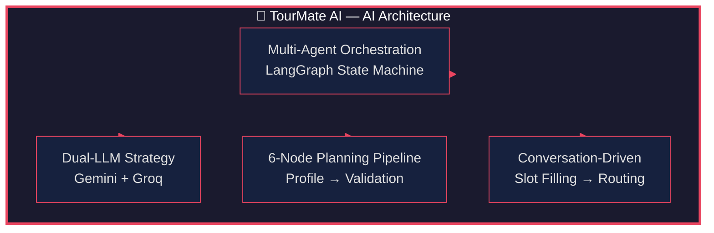

---

## Slide 2: Dual-LLM Strategy

**Core concept:** Not one LLM — two providers, four agent groups, each matched to the right model for cost-efficiency and reliability.

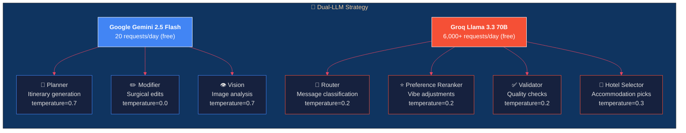

### Key Design Decision

| Why split? | Gemini | Groq |
|---|---|---|
| **Rate limits** | 20 RPD (strict) | 6,000+ RPD (generous) |
| **Cost** | Free-tier capped | Free-tier massive |
| **Best at** | Planning, reasoning, multimodal | Classification, extraction, validation |
| **Agent roles** | Planner, Modifier, Vision | Router, Reranker, Validator, Hotel, Extractor |

**Pattern:** Use Gemini only for complex generation tasks that need its reasoning + multimodal capabilities. Route everything else to Groq (classify, extract, validate, rerank) — 300x more requests per day, same quality for those tasks.

---

## Slide 3: Multi-Agent Orchestration (LangGraph State Machine)

**Core concept:** Instead of one monolithic AI, specialized agents coordinated by a **state machine graph** — each agent handles one responsibility.

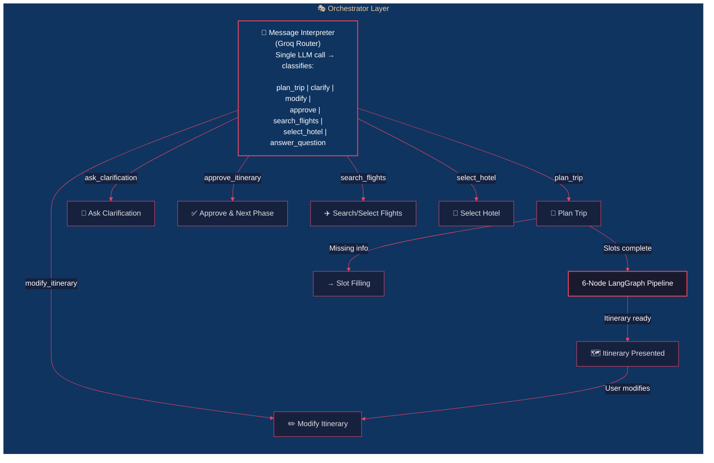

### How it works:

1. **User sends message** → orchestrator reads conversation state from Redis
2. **Message Interpreter** (single Groq call) classifies the intent
3. **Router** dispatches to the correct handler:
   - `plan_trip` → check if slots complete → trigger 6-node pipeline
   - `modify_itinerary` → edit classifier → surgical edit | rerank | full regen
   - `approve_itinerary` → advance to next phase (flights → hotels → booking)
   - `search_flights` → Amadeus API call → format options
   - `select_hotel` → match user choice → transition to booking
4. **Conversation phase** is tracked as a state machine:
   `GREETING → SLOT_FILLING → PLAN_GENERATION → ITINERARY_REVIEW → FLIGHT_SELECTION → HOTEL_SELECTION → BOOKING → COMPLETED`

---

## Slide 4: Conversation Phase State Machine

**Core concept:** 8 distinct phases control what actions are allowed — preventing the user from booking a flight before the itinerary exists, or modifying a trip that's already finalized.

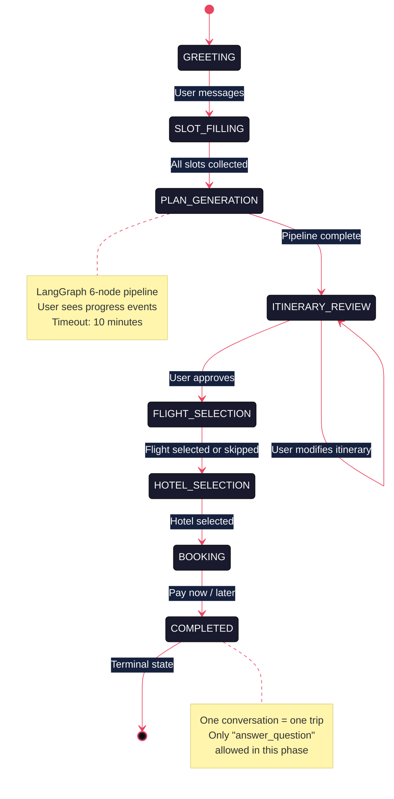

### Safety Overrides (RLHF-style)

The orchestrator overrides the message interpreter when it misclassifies:

| Scenario | Override |
|---|---|
| `ask_clarification` but slots are complete | Force `plan_trip` |
| In `HOTEL_SELECTION` but action ≠ `select_hotel` | Check for hotel keywords → override |
| In `BOOKING` but action ≠ `approve_itinerary` | Check for "pay"/"later" keywords → override |
| `plan_trip` but interests are empty | Force back to `ask_clarification` |

---

## Slide 5: 6-Node LangGraph Pipeline (Itinerary Generation)

**Core concept:** The heart of the AI — a directed graph where each node is a specialized agent. Conditional edges control flow based on outputs.

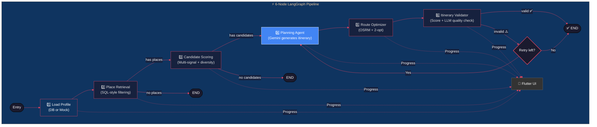

### Node Details

| Node | Model | What it does |
|---|---|---|
| **1. Load Profile** | — | Load per-trip profile from DB; fallback to mock if no auth token |
| **2. Place Retrieval** | — | SQL-style DB filtering by city, category, sub_category, budget |
| **3. Candidate Scoring** | — | Multi-signal formula (embedding similarity + rating + review count) + diversity enforcement |
| **4. Planning Agent** | **Gemini** | Generates themed day-by-day itinerary from top candidates |
| **5. Route Optimizer** | OSRM API | Reorders stops by travel time using OSRM + 2-opt heuristic |
| **6. Itinerary Validator** | **Groq** | Programmatic checks + LLM quality score → retry from planner (max 2x) |

---

## Slide 6: Agent: Message Interpreter (Dual-Intent Router)

**Core concept:** A single Groq Llama 70B call replaces the old 3-call pattern — it sees full conversation history, current phase, and past preferences.

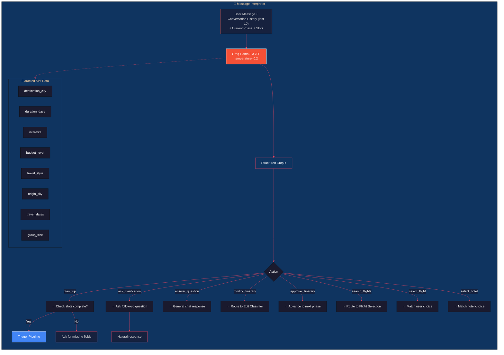

### Hallucination Guard

The orchestrator detects when the LLM invents interests the user never mentioned:

```python
# Check: did the user actually mention these interests?
extracted_interests = router_result.extracted.get("interests")
if extracted_interests and effective_message:
    user_mentioned = any(
        interest.lower() in effective_message.lower()
        for interest in extracted_interests
    )
    if not user_mentioned:
        # Clear hallucinated interests back to None
        state.slots.interests = None
```

---

## Slide 7: Agent: Planning Agent (Itinerary Generator)

**Core concept:** Gemini generates a structured, day-by-day itinerary from a pool of candidate places. If validation fails, the prompt is rebuilt with feedback and retried.

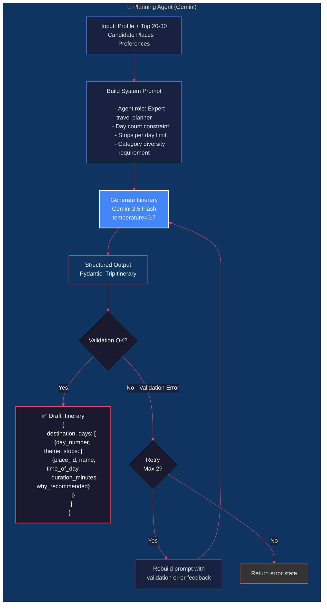

---

## Slide 8: Agent: Edit Classifier (Modify Intent Router)

**Core concept:** When a user wants to change the itinerary, a fast Groq call classifies the edit type → routes to the right handler.

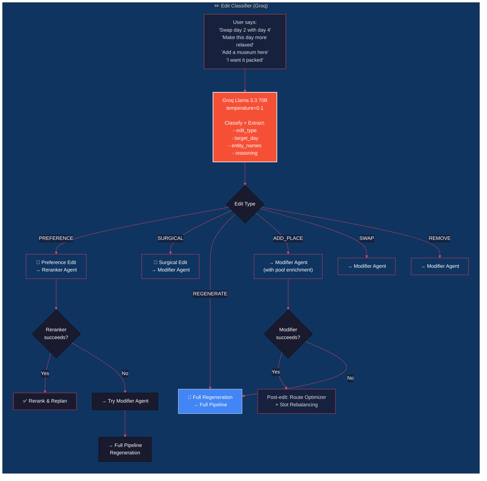

### Fallback Chain

```
User Edit Request
    │
    ├─ Preference Adjustment (Reranker Agent)
    │   │
    │   ├─ Success → Re-rank candidates → Re-plan
    │   │
    │   └─ Failure → Try Modifier Agent
    │                 │
    │                 ├─ Success → Post-edit optimization
    │                 │
    │                 └─ Failure → Full Pipeline Regeneration
    │
    ├─ Surgical Edit (Modifier Agent - delta-based)
    │   │
    │   ├─ Success → Post-edit optimization
    │   │
    │   └─ Failure → Full Pipeline Regeneration
    │
    └─ Full Regeneration
```

---

## Slide 9: Agent: Itinerary Modifier (Surgical Delta Edits)

**Core concept:** Instead of regenerating the entire itinerary, the modifier outputs **delta operations** (REMOVE, SWAP, ADD, REORDER) — cheaper, faster, and preserves unchanged content.

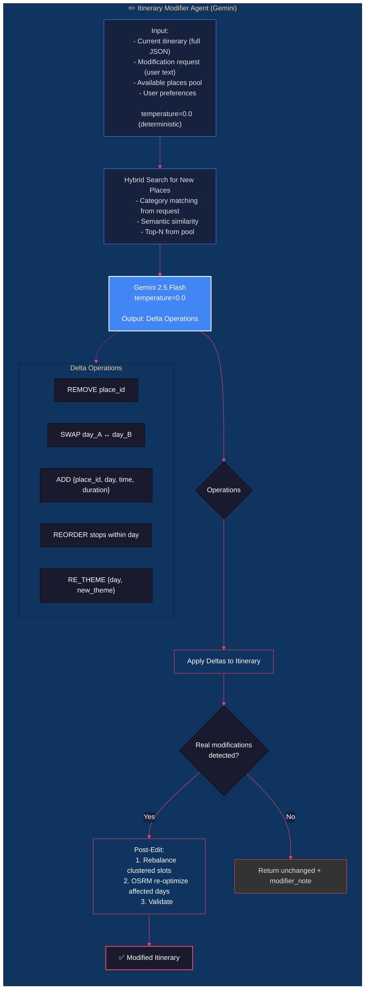

---

## Slide 10: LLM Invocation Layer (Resilience & Fallback)

**Core concept:** Every LLM call goes through `invoke_with_fallback()` — a robust retry layer that handles rate limits, transient errors, schema failures, and key rotation automatically.

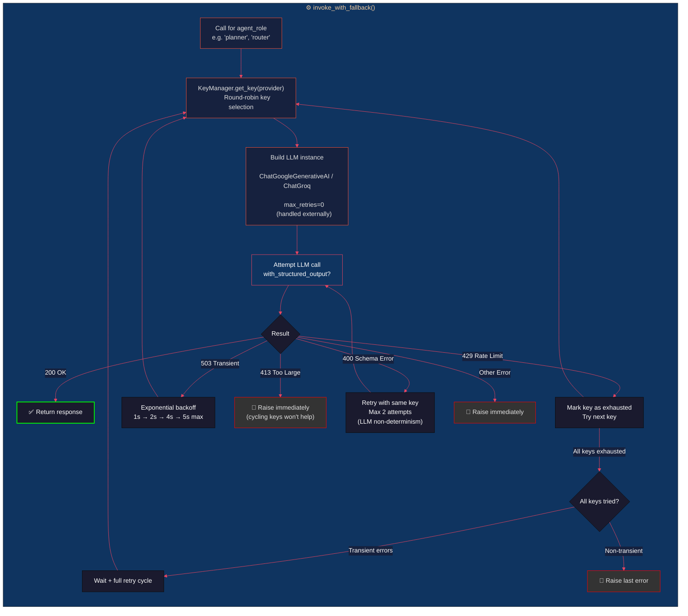

### Error Classification

| HTTP/Error | Classification | Action |
|---|---|---|
| **429** Rate Limit | `_is_rate_limit_error()` | Try next API key immediately |
| **403** Permission Denied (Gemini) | Caught by same function | Treated as rate limit — try next key |
| **503** Service Unavailable | `_is_transient_error()` | Exponential backoff (1s → 2s → 4s → 5s), then retry |
| **413** Request Too Large | `_is_request_too_large_error()` | Raise immediately — no key will fix this |
| **400** Schema Validation | `_is_schema_validation_error()` | Retry same key up to 2x (LLM non-determinism resolves it) |
| Any other | — | Raise immediately |

---

## Slide 11: AI Architecture Layers — Complete Stack

**Everything together:** the full AI Engine from top to bottom.

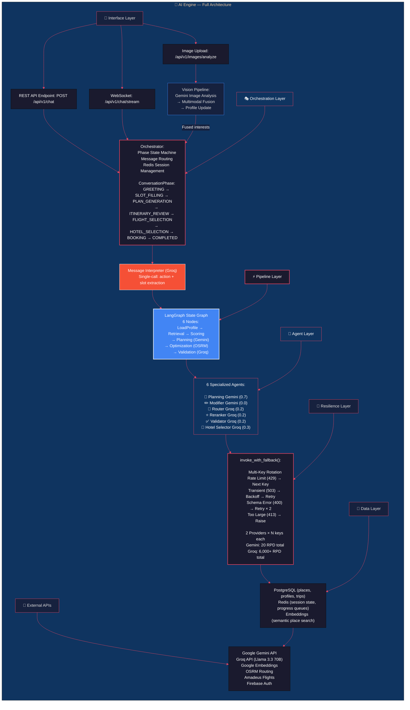

---

## Slide 12: Key Design Principles (Summary Slide)

### 6 Principles That Shaped the AI Architecture

| # | Principle | Implementation |
|---|---|---|
| 1 | **Single-Responsibility Agents** | Each agent handles exactly one task (plan, modify, classify, validate) — no monolithic prompts |
| 2 | **Dual-LLM Cost Optimization** | Gemini for complex generation (20 req/day), Groq for everything else (6,000+ req/day) |
| 3 | **Resilience by Design** | `invoke_with_fallback()`: multi-key rotation, exponential backoff, schema retry — every LLM call is protected |
| 4 | **Surgical Over Regeneration** | Edit classifier → modifier agent (delta ops) → reranker → full regen as last resort |
| 5 | **State Machine Guardrails** | 8 conversation phases prevent invalid actions; RLHF-style overrides fix misclassifications |
| 6 | **Hallucination Defense** | Interest guard clears LLM-invented preferences; safety checks at every transition |

---

## How to Use These Slides

1. **Copy each Mermaid code block** into [Mermaid Live Editor](https://mermaid.live/)
2. **Export as PNG/SVG** for your slides
3. **Insert into PowerPoint / Google Slides / Canva**
4. **Speaker notes** are included in the text below each diagram

### Presentation Ordering

| Slide | Topic | Time (min) |
|---|---|---|
| 1 | Title — AI Architecture overview | 0:30 |
| 2 | Dual-LLM Strategy — why two models | 1:30 |
| 3 | Multi-Agent Orchestration — the state machine | 1:30 |
| 4 | Conversation Phase State Machine — 8 phases | 1:00 |
| 5 | 6-Node LangGraph Pipeline — itinerary generation | 2:00 |
| 6 | Message Interpreter — single-call routing | 1:00 |
| 7 | Planning Agent — itinerary generation | 1:30 |
| 8 | Edit Classifier — modify intent routing | 1:00 |
| 9 | Itinerary Modifier — surgical delta edits | 1:00 |
| 10 | LLM Invocation Layer — resilience & fallback | 1:30 |
| 11 | Full Architecture Stack — all layers together | 1:00 |
| 12 | Key Design Principles — summary | 0:30 |
