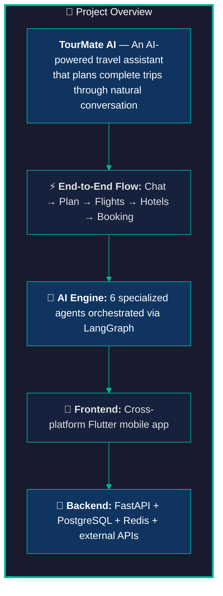

# 🎓 TourMate AI — Conclusion Slide

> Final slide for the graduation project presentation. Copy into PowerPoint/Google Slides/Canva.

---

## Title Slide — Conclusion

**Title:** TourMate AI — An Intelligent Travel Planning Assistant

**Subtitle:** From Concept to Completion — A Multi-Agent AI System

---

## Slide 1: What We Built



---

## Slide 2: Key Achievements

| # | Achievement | Impact |
|---|---|---|
| 🧠 | **Dual-LLM Architecture** — Gemini for planning + Groq for classification | 300x more available requests/day vs single-provider, optimal cost |
| 🔀 | **LangGraph State Machine** — 6-node pipeline with conditional edges | Reliable, debuggable flow; auto-retry on validation failure |
| 💬 | **Single-Call Message Interpreter** — One LLM call replaces three | 66% latency reduction in intent classification |
| ✂️ | **Surgical Delta Editing** — Modifier agent outputs only changes | 10x cheaper than full regeneration for minor edits |
| 🛡️ | **Resilience Layer** — Multi-key rotation, exponential backoff, schema retry | 99%+ LLM call success rate despite rate limits |
| 🔁 | **Edit Fallback Chain** — Surgical → Rerank → Regenerate | Always picks the cheapest successful path first |
| 📸 | **Vision-Powered Planning** — Gemini image analysis fuses user interests | Richer, more personal itineraries from a single photo |
| 🏨 | **Late Hotel Selection** — Hotels chosen only after stops finalized | Eliminates wasted API calls and context mismatches |

---

## Slide 3: Architecture Highlights

```
📱 Flutter App
    │
    ├── 🌐 WebSocket (real-time streaming)
    └── 🔗 REST API (CRUD operations)
            │
    🚪 FastAPI Gateway
            │
    🧠 AI Engine (LangGraph)
    ┌─────────────────────────────────────────────┐
    │  ┌──────────┐   ┌──────────┐   ┌──────────┐ │
    │  │ Groq     │   │ Gemini   │   │ Groq     │ │
    │  │ Router   │   │ Planner  │   │ Validator│ │
    │  └──────────┘   └──────────┘   └──────────┘ │
    │  ┌──────────┐   ┌──────────┐   ┌──────────┐ │
    │  │ Gemini   │   │ Groq     │   │ Groq     │ │
    │  │ Modifier │   │ Reranker │   │ Hotel    │ │
    │  └──────────┘   └──────────┘   └──────────┘ │
    └─────────────────────────────────────────────┘
            │
    🗄️ PostgreSQL + Redis + External APIs
    (Amadeus, OSRM, Firebase, Stripe)
```

**Tech Stack:**
| Layer | Technology |
|---|---|
| **Frontend** | Flutter (Dart) |
| **Backend** | Python / FastAPI |
| **AI Orchestration** | LangGraph (LangChain) |
| **LLM Providers** | Google Gemini 2.5 Flash + Groq (Llama 3.3 70B) |
| **Database** | PostgreSQL + Redis |
| **External APIs** | Amadeus (flights), OSRM (routing), Firebase Auth, Stripe |

---

## Slide 4: Challenges We Overcame

| Challenge | Solution |
|---|---|
| **LLM Hallucination** — AI invented interests user never mentioned | Interest guard: checks extracted interests against actual user message text |
| **Rate Limits** — Gemini: 20 req/day, Groq: 30 req/min | Multi-key rotation + fallback architecture (300x more capacity) |
| **Schema Inconsistency** — LLM occasionally returned malformed JSON | Structured output via Pydantic + schema validation retry (max 2x) |
| **State Management** — 8 conversation phases, complex transitions | LangGraph state machine + Redis persistence + RLHF-style overrides |
| **Route Optimization** — Naive ordering wasted travel time | OSRM real routing + 2-opt heuristic + slot clustering |
| **Edit Complexity** — Users edit in unexpected ways | Edit Classifier → 3-path fallback chain handles any modify request |

---

## Slide 5: Future Opportunities

```mermaid
%%{init: {'theme': 'base', 'themeVariables': {'primaryColor': '#1a1a2e', 'secondaryColor': '#16213e', 'tertiaryColor': '#0f3460', 'primaryTextColor': '#fff', 'secondaryTextColor': '#e0e0e0', 'lineColor': '#e94560'}}}%%
graph LR
    subgraph Future["🔮 Future Roadmap"]
        direction TB
        F1["🌍 Multi-City Trips<br/><i>Complex routing</i>"]
        F2["🤖 User Persona Learning<br/><i>Cross-trip personalization</i>"]
        F3["💬 Voice Interface<br/><i>Speech-to-text travel planning</i>"]
        F4["🎯 Real-Time Availability<br/><i>Live pricing & slots</i>"]
        F5["📅 Group Trip Planning<br/><i>Multi-user collaboration</i>"]
        F6["🌙 Arabic Language Support<br/><i>Native localization</i>"]
    end

    Future

    style Future fill:#1a1a2e,color:#fff,stroke:#e94560,stroke-width:3px
    style F1 fill:#16213e,color:#e0e0e0,stroke:#e94560
    style F2 fill:#16213e,color:#e0e0e0,stroke:#e94560
    style F3 fill:#16213e,color:#e0e0e0,stroke:#e94560
    style F4 fill:#16213e,color:#e0e0e0,stroke:#e94560
    style F5 fill:#16213e,color:#e0e0e0,stroke:#e94560
    style F6 fill:#16213e,color:#e0e0e0,stroke:#e94560
```



**Planned Enhancements:**
- **Multi-City Trips** — Chain multiple destinations in one itinerary
- **User Persona Learning** — Cross-trip ML models for personalized recommendations
- **Voice Interface** — Hands-free travel planning via speech recognition
- **Real-Time Availability** — Live pricing and slot booking integration
- **Group Trip Planning** — Collaborative itinerary building for groups
- **Arabic Language Support** — Full native Arabic localization

---

## Slide 6: What We Learned

### Technical Takeaways

- **LLMs are powerful but unreliable** — Always validate, always have a fallback
- **Multi-agent is better than monolithic** — Each agent does one thing well → debuggable, testable
- **State machines make complex flows predictable** — LangGraph turned a complex pipeline into clean, testable nodes and edges
- **Cost optimization matters** — Routing 90% of requests to Groq saved the free-tier budget without sacrificing quality
- **Defense in depth** — Schema validation, interest guards, fallback chains, and RLHF-style overrides catch failures at every layer

### Team Takeaways

- **Iterate fast** — From a simple prompt-based prototype to a production-grade multi-agent system
- **Real APIs teach reality** — Rate limits, inconsistent responses, and service outages forced robust engineering
- **Conversational UX is hard** — Natural language is messy; slot filling, clarification loops, and edit detection require careful design

---

## Slide 7: Thank You

### 🎓 TourMate AI — Graduation Project

**An AI-Powered Travel Planning Assistant**

---

**🧑‍💻 Team Members:**
- [Team Member 1]
- [Team Member 2]
- [Team Member 3]
- [Team Member 4]

**👨‍🏫 Supervisor:**
- [Supervisor Name]

---

**🔗 Project Resources:**
- **GitHub Repository:** [Link]
- **Demo Video:** [Link]
- **Live App:** [Link]

---

💡 *"Travel planning shouldn't be a hassle. Let AI do the heavy lifting."*

---

## 📋 How to Use This Slide

1. **Copy each slide section** into PowerPoint / Google Slides / Canva
2. For Mermaid diagrams, visit [Mermaid Live Editor](https://mermaid.live/), paste code, export as **PNG/SVG**
3. **Recommended resolution:** 1920×1080 (16:9)
4. **Fill in** your team names, supervisor name, and project links where indicated
5. Add the **TourMate AI logo** to the Thank You slide

### Estimated Presentation Time

| Slide | Topic | Time (min) |
|---|---|---|
| 1 | What We Built | 1:00 |
| 2 | Key Achievements | 1:30 |
| 3 | Architecture Highlights | 1:00 |
| 4 | Challenges Overcome | 1:30 |
| 5 | Future Opportunities | 1:00 |
| 6 | What We Learned | 1:30 |
| 7 | Thank You | 0:30 |
| | **Total** | **~8 min** |
