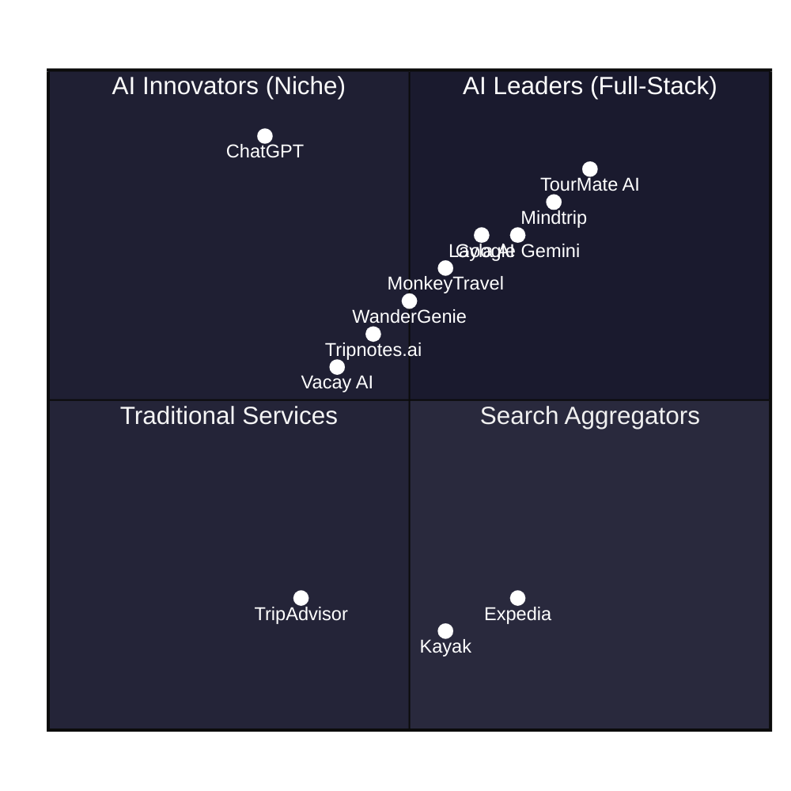

# 📊 TourMate AI — Market Survey & Competitive Analysis

> Slides for the graduation project presentation. Copy into PowerPoint/Google Slides/Canva.

---

## Slide 1: Title Slide

**Title:** Travel Planning Landscape — Market Survey & Competitive Analysis

**Subtitle:** TourMate AI vs The Competition — What's Out There & Where We Fit

---

## Slide 2: The Problem — Why Travel Planning is Still Broken

| Pain Point | Description |
|---|---|
| 🔴 **10+ Open Tabs** | Travelers juggle Google, TripAdvisor, Kayak, Booking.com, blogs, and maps simultaneously |
| 🟠 **Manual Research** | Reading hundreds of reviews, checking opening hours, comparing prices — all by hand |
| 🟠 **Static Plans** | Once built, itineraries can't adapt to flight delays, weather, or new preferences |
| 🟠 **Booking Friction** | Planning and booking are separate workflows — context is lost at checkout |
| 🟠 **Generic Recommendations** | Most tools ignore personal preferences, travel style, and budget constraints |
| 🔴 **Overwhelm** | Too many choices → decision paralysis → trip never gets planned |

**Key Stat:** The average traveler visits **38 websites** before booking a trip (Expedia study).

---

## Slide 3: Competitive Landscape — Overview



---

## Slide 4: Competitor Deep-Dive — Dedicated AI Travel Planners

| Competitor | What It Does | Strengths | Weaknesses | Price |
|---|---|---|---|---|
| **🧠 TourMate AI** | Conversational AI: chat → plan → flights → hotels → booking | Multi-agent orchestration, dual-LLM, surgical editing, full booking pipeline, vision analysis | — | Free-tier LLMs |
| **Mindtrip** | End-to-end AI planning + booking via Priceline/Viator | 11M+ POI database, integrated maps, booking links | No real-time re-planning, UI-heavy, limited hotel selection | Free |
| **Layla AI** | Price-focused AI travel assistant | Live Skyscanner/Booking.com pricing, PriceLock | Limited to price optimization, no itinerary modification | Free |
| **MonkeyTravel** | Fast, no-signup itinerary generation | Speed, group voting feature | Basic itineraries, no booking, no flights/hotels | Free |
| **WanderGenie** | Budget-focused travel companion | Group travel support, real-time updates | Weak itinerary detail, limited destination coverage | Free / Freemium |
| **Tripnotes.ai** | Smart organizer — turns notes into mapped itineraries | Great at aggregation, auto-mapping | No AI generation, no booking, passive organization | Free |
| **Vacay AI** | Conversational travel brainstorming | Good for ideation, natural chat | No booking, no real data, purely generative | Free |
| **Wonderplan** | Budget-focused itinerary builder | Cost-aware recommendations | UI quality, limited destination data | Free |

---

## Slide 5: Competitor Deep-Dive — Major Platforms with AI Features

| Platform | AI Feature | Limitations vs TourMate |
|---|---|---|
| **Google Gemini / Travel** | Direct integration with Maps, Flights, Hotels, Gmail | Fragmented UX — no unified conversation, no itinerary editing |
| **ChatGPT** | General-purpose travel brainstorming | No structured output, no real-time data, no booking pipeline |
| **Kayak.ai** | Conversational flight search + price tracking | Flights only — no hotels, no itinerary, no planning |
| **Expedia** | AI matches itineraries with social media content | Content discovery only — no natural language planning |
| **TripAdvisor** | AI summarizes reviews into theme-based highlights | Review aggregation only — no planning or booking |
| **Roam Around** | Quick day-by-day itinerary generation | Surface-level plans, no customization, no booking |

**Key Insight:** Major platforms add AI as a **feature**, not a **core experience**. TourMate AI is built AI-first from the ground up.

---

## Slide 6: Feature Comparison Matrix

| Feature | TourMate AI | Mindtrip | Layla AI | MonkeyTravel | WanderGenie | ChatGPT | Google Travel |
|---|---|---|---|---|---|---|---|
| Natural Language Chat | ✅ Full | ✅ | ✅ | ❌ | ✅ | ✅ | ❌ |
| Multi-Day Itinerary | ✅ AI-generated | ✅ | ❌ | ✅ | ✅ | ✅ Manual | ❌ |
| Themed Day Planning | ✅ Themed | ❌ | ❌ | ❌ | ❌ | ❌ | ❌ |
| Route Optimization | ✅ OSRM + 2-opt | ❌ | ❌ | ❌ | ❌ | ❌ | ❌ |
| Flight Search & Select | ✅ Amadeus | ❌ | ✅ Skyscanner | ❌ | ✅ | ❌ | ✅ Google |
| Hotel Selection | ✅ AI-recommended | ✅ Priceline | ✅ Booking.com | ❌ | ✅ | ❌ | ✅ Google |
| Full Booking Pipeline | ✅ Pay now / later | ❌ Links out | ❌ Links out | ❌ | ❌ | ❌ | ❌ Links out |
| Itinerary Modification | ✅ Surgical edit | ❌ Regenerate only | ❌ | ❌ | ❌ | ❌ Manual | ❌ |
| Preference Reranking | ✅ AI-driven | ❌ | ❌ | ❌ | ❌ | ❌ Manual | ❌ |
| Image/Vision Analysis | ✅ Gemini Vision | ❌ | ❌ | ❌ | ❌ | ✅ GPT-4V | ❌ |
| Real-Time Progress | ✅ Streaming | ❌ | ❌ | ❌ | ❌ | ❌ | ❌ |
| Multi-Agent AI | ✅ LangGraph | ❌ Single LLM | ❌ Single LLM | ❌ Basic | ❌ Basic | ❌ Single LLM | ❌ Rule-based |
| Edit Fallback Chain | ✅ 3-path | ❌ | ❌ | ❌ | ❌ | ❌ | ❌ |
| Hallucination Guard | ✅ Interest check | ❌ | ❌ | ❌ | ❌ | ❌ | ❌ |
| Price | Free (LLM) | Free | Free | Free | Free | $20/mo | Free |

---

## Slide 7: What Competitors Do Well

### 🟢 Dedicated AI Planners (Mindtrip, Layla, WanderGenie)
- **Quick itinerary generation** from a single prompt
- **Aggregating data** from multiple sources (flights, hotels, POIs)
- **Price-conscious recommendations** (Layla's PriceLock, WanderGenie's budget focus)
- **No-signup access** (MonkeyTravel lowers the barrier to entry)

### 🟢 Major Platforms (Google, Kayak, Expedia)
- **Reliable real-time data** — live flights, hotel availability, maps
- **Massive user bases** and established trust
- **Integrated booking** — actual purchase capability (Google Flights, Expedia)
- **Review aggregation** at scale (TripAdvisor's millions of reviews)

### 🟢 General AI (ChatGPT, Gemini)
- **Broad knowledge** across any destination or travel question
- **Creative ideation** — suggesting unique, non-obvious destinations
- **Multimodal** — can analyze photos, documents, screenshots

---

## Slide 8: What Competitors DON'T Do (Market Gaps)

| # | Gap | Current Solutions | TourMate AI Advantage |
|---|---|---|---|
| **1** | **🧠 True Multi-Agent Orchestration** | Most use a single LLM call → generic, error-prone outputs | 6 specialized agents: Router, Planner, Modifier, Validator, Reranker, Hotel — each doing one job well |
| **2** | **✂️ Surgical Itinerary Editing** | "Regenerate everything" — expensive, loses context | Delta-based modifier: REMOVE, SWAP, ADD, REORDER — 10x cheaper, preserves unchanged content |
| **3** | **🔁 Edit Fallback Chain** | One attempt → fail → user starts over | Surgical → Rerank → Regenerate — always picks the cheapest successful path |
| **4** | **📸 Vision-Powered Planning** | No competitor uses image analysis for trip preferences | Gemini Vision extracts interests, style, pace from user photos |
| **5** | **🛡️ Hallucination Defense** | LLMs invent interests and places — no guardrails | Interest guard: cross-checks extracted slots against actual user message |
| **6** | **🏨 Late Hotel Selection** | Hotels shown too early → wasted API calls | Hotels selected only after itinerary stops are finalized |
| **7** | **📡 Real-Time Streaming Progress** | Users wait in silence during generation | Streaming progress events: "Loading profile" → "Finding places" → "Planning" → "Optimizing" |
| **8** | **🔧 Resilience Layer** | Single API key → rate limits crash the flow | Multi-key rotation + exponential backoff + schema retry — 99%+ reliability |
| **9** | **💬 Conversation State Machine** | Stateless or simple phase tracking | 8-phase state machine (GREETING → COMPLETED) with RLHF-style safety overrides |
| **10** | **💰 Dual-LLM Cost Optimization** | All requests hit expensive LLMs | Gemini 20/day for complex tasks, Groq 6,000+/day for classifications — 300x throughput |

---

## Slide 9: TourMate AI — Unique Value Proposition

```mermaid
%%{init: {'theme': 'base', 'themeVariables': {'primaryColor': '#1a1a2e', 'secondaryColor': '#16213e', 'tertiaryColor': '#0f3460', 'primaryTextColor': '#fff', 'secondaryTextColor': '#e0e0e0', 'lineColor': '#00b894'}}}%%
graph TB
    subgraph UVP["⭐ TourMate AI — Unique Value Proposition"]
        direction TB
        
        UVP1["<b>AI-First Architecture</b>
        Not AI as a feature — AI as the core experience
        Built on LangGraph state machine from day one
        
        vs Competitors: AI bolted onto existing search UI"]
        
        UVP2["<b>Full-Stack Planning</b>
        One conversation: Chat → Itinerary → Flights → Hotels → Booking
        No handoffs. No context loss. No browser tabs.
        
        vs Competitors: Planning only, or search only — never both"]
        
        UVP3["<b>Resilient by Design</b>
        Multi-key fallback · Exponential backoff · Schema retry
        Interest guards · Edit fallback chain · Phase safety overrides
        
        vs Competitors: Single point of failure, no fallbacks"]
        
        UVP4["<b>Surgical Over Regeneration</b>
        Delta-based editing: REMOVE, SWAP, ADD, REORDER
        10x cheaper · preserves context · keeps user happy
        
        vs Competitors: Full re-generation for every edit"]
        
        UVP5["<b>Cost-Optimized Dual-LLM</b>
        Gemini for complex reasoning (20/day) + Groq for classification (6,000+/day)
        300x more capacity than single-LLM competitors
        
        vs Competitors: All eggs in one API basket"]
    end
    
    UVP1 --> UVP2 --> UVP3 --> UVP4 --> UVP5
    
    style UVP fill:#1a1a2e,color:#fff,stroke:#00b894,stroke-width:3px
    style UVP1 fill:#0f3460,color:#fff,stroke:#00b894
    style UVP2 fill:#16213e,color:#e0e0e0,stroke:#00b894
    style UVP3 fill:#0f3460,color:#fff,stroke:#00b894
    style UVP4 fill:#16213e,color:#e0e0e0,stroke:#00b894
    style UVP5 fill:#0f3460,color:#fff,stroke:#00b894
```



---

## Slide 10: Market Positioning — Where TourMate AI Stands

```
                    AI-Powered
                        ↑
                        |    🧠 TourMate AI
                        |    (AI-first, full-stack, multi-agent)
                        |
    Niche /     ◀———————|———————▶  Comprehensive /
    Simple               |               Full-Stack
                        |    Mindtrip ●  ● Google Travel
                        |    Layla ●
                        |    MonkeyTravel ●
                        |    WanderGenie ●
                        |    Tripnotes ●
                        |
                        |    ◆ ChatGPT / Gemini (general AI)
                        |
                        |    ● TripAdvisor  ● Expedia  ● Kayak
                        |
                        ↓
                    Human / Search-Based
```

**TourMate AI's Position:** The only AI-first, full-stack, multi-agent travel planning assistant that covers the entire journey from conversation to booking — with resilience, cost optimization, and surgical editing built into the architecture.

---

## Slide 11: SWOT Analysis

| **Strengths (Internal)** | **Weaknesses (Internal)** |
|---|---|
| ✅ Multi-agent orchestration (6 specialized agents) | ❌ Limited to free-tier LLM rate limits |
| ✅ Dual-LLM cost optimization (300x throughput) | ❌ No real-time pricing data (Amadeus sandbox) |
| ✅ Full booking pipeline (chat → payment) | ❌ Smaller place database vs Google/TripAdvisor |
| ✅ Surgical editing (10x cheaper than regen) | ❌ Limited destination coverage (seed data only) |
| ✅ Vision-powered trip planning | ❌ No mobile app (Flutter frontend separate) |
| ✅ Hallucination defense & RLHF overrides | ❌ No collaborative / group planning yet |

| **Opportunities (External)** | **Threats (External)** |
|---|---|
| 🌍 Growing AI travel market ($700B+ travel industry) | ⚠️ Google/Gemini could launch competing AI planner |
| 🤖 Increasing LLM capabilities + lower costs | ⚠️ ChatGPT plugins adding structured travel planning |
| 📈 Post-pandemic travel boom | ⚠️ Established OTAs acquiring AI startups |
| 🎯 Niche underserved segments (budget, solo, adventure) | ⚠️ LLM hallucination risks damaging user trust |
| 🌙 Arabic language / MENA region market gap | ⚠️ API dependency (Amadeus, OSRM, Stripe) |

---

## Slide 12: Summary — Why TourMate AI Stands Out

| Competitor Gap | TourMate AI Solution |
|---|---|
| ❌ Single LLM call → generic output | ✅ **6 specialized agents** orchestrated by LangGraph |
| ❌ Full regeneration for every edit | ✅ **Surgical delta editing** — 10x cheaper, preserves context |
| ❌ No fallback on AI failure | ✅ **3-path fallback chain**: Surgical → Rerank → Regenerate |
| ❌ No hallucination protection | ✅ **Interest guard** cross-checks AI output against user input |
| ❌ No image-based planning | ✅ **Gemini Vision** extracts preferences from user photos |
| ❌ No real-time progress updates | ✅ **Streaming pipeline** events to the frontend |
| ❌ Single API key = single point of failure | ✅ **Multi-key rotation** + exponential backoff + schema retry |
| ❌ Planning OR booking — never both | ✅ **End-to-end pipeline**: Chat → Plan → Flights → Hotels → Booking |
| ❌ All requests to expensive LLMs | ✅ **Dual-LLM**: Gemini for complex, Groq for fast (300x throughput) |
| ❌ No conversation state management | ✅ **8-phase state machine** with RLHF-style safety overrides |

---

## 📋 How to Use This Slide Deck

1. **Copy each slide section** into PowerPoint / Google Slides / Canva
2. For Mermaid diagrams, paste code into [Mermaid Live Editor](https://mermaid.live/) → export as PNG/SVG
3. **Recommended export resolution:** 1920×1080 (16:9)
4. Slides 3-4-5 are the most important for showing depth of research
5. **Slide 10** (Market Positioning) is the strongest visual for the professor

### Estimated Presentation Time

| Slide | Topic | Time (min) |
|---|---|---|
| 1 | Title | 0:30 |
| 2 | The Problem | 1:00 |
| 3 | Competitive Landscape (Quadrant) | 0:30 |
| 4 | AI Travel Planners Deep-Dive | 1:30 |
| 5 | Major Platforms Deep-Dive | 1:00 |
| 6 | Feature Comparison Matrix | 1:30 |
| 7 | Competitor Strengths | 1:00 |
| 8 | Market Gaps (What They DON'T Do) | 2:00 |
| 9 | TourMate AI's UVP | 1:30 |
| 10 | Market Positioning | 1:00 |
| 11 | SWOT Analysis | 1:30 |
| 12 | Summary | 1:00 |
| | **Total** | **~14 min** |
