# TourMate AI — AI Engine Pipeline (Mermaid Diagram)

Copy the code below into any Mermaid-compatible tool.

---


```mermaid
%%{init: {'theme': 'dark', 'themeVariables': { 'primaryColor': '#1a1a2e', 'primaryTextColor': '#e0e0e0', 'primaryBorderColor': '#e94560', 'lineColor': '#e94560', 'secondaryColor': '#16213e', 'tertiaryColor': '#0f3460', 'clusterBkg': '#1a1a2e', 'clusterBorder': '#e94560'}}}%%

flowchart LR
    subgraph Input["📥 Input"]
        direction LR
        IN1[("User Message")]
        IN2[("Uploaded Image")]
    end

    subgraph Preprocess["🔍 Preprocessing"]
        AI0["Message Interpreter<br/><i>Classifies intent</i>"]
        VIS["Gemini Vision<br/><i>Image analysis</i>"]
        PP["Profile Updater<br/><i>Load/Sync profile</i>"]
    end

    subgraph Core["🧠 Core Pipeline (LangGraph)"]
        direction TB
        
        subgraph Phase1["Phase 1: Planning"]
            P1["Planning Agent<br/><i>Generates full itinerary</i>"]
        end

        subgraph Phase2["Phase 2: Retrieval"]
            P2["Place Retriever<br/><i>Semantic place search</i>"]
            P2A["Candidate Scorer<br/><i>Scores candidates</i>"]
        end

        subgraph Phase3["Phase 3: Optimization"]
            P3["Route Optimizer<br/><i>OSRM-based routing</i>"]
            P3A["Slot Normalizer<br/><i>Time-slot assignment</i>"]
        end

        subgraph Phase4["Phase 4: Selection"]
            P4["Flight Selection Agent<br/><i>Amadeus flight search</i>"]
            P4A["Hotel Agent<br/><i>Accommodation recs</i>"]
        end

        subgraph Phase5["Phase 5: Refinement"]
            P5["Preference Reranker<br/><i>Rerank by profile</i>"]
            P5A["Feasibility Checker<br/><i>Validate itinerary</i>"]
        end

        subgraph Phase6["Phase 6: Modification (if needed)"]
            direction TB
            P6["Edit Classifier<br/><i>Classifies edit type</i>"]
            P6A["Itinerary Modifier Agent<br/><i>Surgical edit</i>"]
            P6B["Full Regeneration<br/><i>Fallback</i>"]
        end
    end

    subgraph Output["📤 Output"]
        O1["Formatted Itinerary"]
        O2["Flight Booking"]
        O3["Hotel Suggestions"]
        O4["Updated Trip Status"]
        O5["Streaming Chat Response"]
    end

    subgraph DataSources["🗄️ Data Sources"]
        D1[("PostgreSQL<br/>Trips, Places, Bookings")]
        D2[("Redis<br/>Conversation State")]
        D3[("User Profile<br/>Preferences & Persona")]
    end

    %% Flow connections
    IN1 --> AI0
    IN2 --> VIS
    AI0 --> PP
    VIS --> PP
    PP --> Phase1

    Phase1 --> Phase2
    Phase2 --> Phase2A
    Phase2A --> Phase3
    Phase3 --> Phase3A
    Phase3A --> Phase4

    Phase4 --> Phase5
    Phase5 --> Phase5A

    Phase5A -->|"Approved"| Output
    Phase5A -->|"Needs edits"| Phase6

    Phase6 --> P6
    P6 -->|"Surgical"| P6A
    P6 -->|"Major change"| P6B
    P6A --> Phase5
    P6B --> Phase1

    PP <--> D3
    P2 <--> D1
    P2A <--> D3
    P4 -->|"Amadeus API"| O2
    P4A -->|"Search"| O3
    P5A --> D1
    AI0 <--> D2

    style Input fill:#16213e,stroke:#6c63ff,stroke-width:2px
    style Preprocess fill:#0f3460,stroke:#6c63ff,stroke-width:2px
    style Core fill:#1a1a2e,stroke:#e94560,stroke-width:2px
    style Output fill:#16213e,stroke:#00b894,stroke-width:2px
    style DataSources fill:#0f3460,stroke:#e94560,stroke-width:2px
    style Phase6 fill:#2d1b1b,stroke:#ff6b6b,stroke-width:1px
```

```

---

## 📋 How to use

1. Copy the entire code block above
2. Paste into **[Mermaid Live Editor](https://mermaid.live/)** → Export as PNG/SVG for slides
3. Or paste directly into GitHub README, Notion, Obsidian, etc.

### Tips for presentations:
- **Mermaid Live Editor** can export high-resolution PNG/SVG — perfect for slides
- Use **dark mode** theme to match your deck aesthetics
- The colors are set to a dark purple/blue theme with red accents
