# TourMate AI — System Architecture (Mermaid Diagram)

Copy the code below into any Mermaid-compatible tool (Mermaid Live Editor, GitHub README, Notion, or presentation tool).

---


```mermaid
%%{init: {'theme': 'dark', 'themeVariables': { 'primaryColor': '#1a1a2e', 'primaryTextColor': '#e0e0e0', 'primaryBorderColor': '#6c63ff', 'lineColor': '#6c63ff', 'secondaryColor': '#16213e', 'tertiaryColor': '#0f3460', 'clusterBkg': '#1a1a2e', 'clusterBorder': '#6c63ff'}}}%%

flowchart TB
    subgraph Client["📱 Client Layer (Flutter)"]
        direction LR
        A1["Chat UI<br/><i>Real-time messaging</i>"]
        A2["Trip Planner<br/><i>Itinerary viewer</i>"]
        A3["Booking UI<br/><i>Flights & Hotels</i>"]
        A4["Profile & Reviews<br/><i>User preferences</i>"]
    end

    subgraph API["🚪 API Gateway Layer (FastAPI)"]
        direction TB
        B0["📡 WebSocket Server<br/><i>Streaming responses</i>"]
        B1["/api/v1/auth<br/><i>Firebase Auth</i>"]
        B2["/api/v1/chat<br/><i>Conversation</i>"]
        B3["/api/v1/trips<br/><i>CRUD + status</i>"]
        B4["/api/v1/flights<br/><i>Search & Book</i>"]
        B5["/api/v1/bookings<br/><i>Payments (Stripe)</i>"]
        B6["/api/v1/places<br/><i>Search & Details</i>"]
        B7["/api/v1/itinerary<br/><i>Stops & Routes</i>"]
        B8["/api/v1/reviews<br/><i>Feedback</i>"]
        B9["/api/v1/images<br/><i>Upload & Vision</i>"]
        B10["/api/v1/users<br/><i>Preferences</i>"]

        subgraph MW["Middleware Stack"]
            M1["CORS"]
            M2["Error Handler"]
            M3["Logging"]
            M4["Auth (Firebase)"]
        end
    end

    subgraph Services["⚙️ Service Layer"]
        direction TB
        S1["Auth Service"]
        S2["Chat Service"]
        S3["Itinerary Service"]
        S4["Flight Service"]
        S5["Booking Service"]
        S6["Places Service"]
        S7["Profile Service"]
        S8["Image Service"]
        S9["Feedback Service"]
        S10["User Service"]

        subgraph Repos["Repository Layer"]
            R1["BaseRepo"]
            R2["ItineraryRepo"]
            R3["PlaceRepo"]
            R4["ProfileRepo"]
        end
    end

    subgraph AI["🧠 AI Engine (LangGraph)"]
        direction TB
        AI0["Message Interpreter<br/><i>Classifies user intent</i>"]
        AI1["Trip Planning Graph"]
        AI2["✈️ Flight Selection Agent"]
        AI3["🏨 Hotel Agent"]
        AI4["✂️ Itinerary Modifier Agent"]
        AI5["🎯 Preference Reranker Agent"]
        AI6["🧩 Edit Classifier Agent"]
        AI7["👤 Profile Updater<br/><i>Persona tracking</i>"]
        AI8["🔍 Place Retriever<br/><i>Semantic search</i>"]
        AI9["📐 Route Optimizer"]
    end

    subgraph External["🔌 External Integrations"]
        direction LR
        E1["Firebase Auth<br/><i>JWT verification</i>"]
        E2["Amadeus API<br/><i>Flight search/booking</i>"]
        E3["Stripe<br/><i>Payment processing</i>"]
        E4["OSRM<br/><i>Open Source Routing</i>"]
        E5["Google Gemini 2.5 Pro<br/><i>LLM + Vision</i>"]
        E6["Groq (Llama 3.3-70B)<br/><i>Supplementary LLM</i>"]
        E7["Google Places API<br/><i>Place search</i>"]
        E8["Google Embeddings<br/><i>Semantic vectors</i>"]
    end

    subgraph Storage["🗄️ Data Layer"]
        direction LR
        D1[("PostgreSQL<br/><i>Primary DB</i>")]
        D2[("Redis<br/><i>Session & Cache</i>")]
    end

    %% Connections
    Client <-->|"WebSocket (real-time)"| B0
    Client <-->|"REST API (CRUD)"| B1 & B2 & B3 & B4 & B5 & B6 & B7 & B8 & B9 & B10

    B0 & B1 & B2 & B3 & B4 & B5 & B6 & B7 & B8 & B9 & B10 --> MW
    MW --> Services

    S1 --> E1
    S4 --> E2
    S5 --> E3
    S6 --> E7
    S2 --> AI
    S3 --> AI
    S8 --> E5

    S1 & S2 & S3 & S4 & S5 & S6 & S7 & S8 & S9 & S10 --> Repos
    Repos --> D1
    S2 <-->|"conversation state"| D2

    AI --> E5
    AI --> E6
    AI --> E8
    AI0 --> AI1
    AI1 --> AI2 & AI3 & AI4 & AI5 & AI6 & AI7 & AI8 & AI9

    AI2 --> E2
    AI8 --> E7
    AI9 --> E4

    style Client fill:#16213e,stroke:#6c63ff,stroke-width:2px
    style API fill:#0f3460,stroke:#6c63ff,stroke-width:2px
    style AI fill:#1a1a2e,stroke:#e94560,stroke-width:2px
    style Services fill:#16213e,stroke:#6c63ff,stroke-width:2px
    style External fill:#0f3460,stroke:#0f3460,stroke-width:2px
    style Storage fill:#16213e,stroke:#e94560,stroke-width:2px
```

```

---

## 📋 How to use

1. Copy the entire code block above (everything between the ` ```mermaid ` tags)
2. Paste into:
   - **[Mermaid Live Editor](https://mermaid.live/)** — preview and export as PNG/SVG
   - **GitHub README.md** — renders natively
   - **Notion** — paste into `/code` or `/mermaid` block
   - **Obsidian** — paste into a ````mermaid```` code block
   - **Google Slides / PowerPoint** — export as PNG from Mermaid Live and insert
