# TourMate AI — Presentation Slides: User Workflow Flow Diagram

Copy each slide's content into your presentation tool (PowerPoint, Google Slides, Canva, etc.).

---

## 📽️ Slide 1 — Title Slide

**Title:** TourMate AI — Intelligent Travel Planning Workflow

**Subtitle:** From User Request to Personalized Trip Booking

**Bottom text:** Graduation Project — AI-Powered Travel Assistant

**Suggested Visual:** Place the TourMate AI logo centered, with a world map background silhouette, and the 6 main phase icons in a horizontal row at the bottom:
```
[💬 Chat] → [🧠 AI Plans] → [✈️ Flights] → [🏨 Hotels] → [💳 Booking] → [✅ Done]
```

---

## 📽️ Slide 2 — User Sends a Request

**Title:** Step 1 — User Sends a Request

**Visual:**

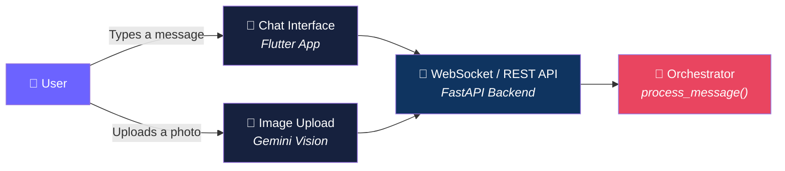

**Key Points:**
- User types a natural language message (e.g., "Plan a 5-day trip to Cairo")
- OR uploads a travel photo for visual analysis
- Message sent via WebSocket for real-time streaming
- REST API for CRUD operations

**Example User Input:** `"Plan a romantic 5-day trip to Cairo with a moderate budget"`

---

## 📽️ Slide 3 — Message Interpretation

**Title:** Step 2 — AI Interprets the Message

**Visual:**

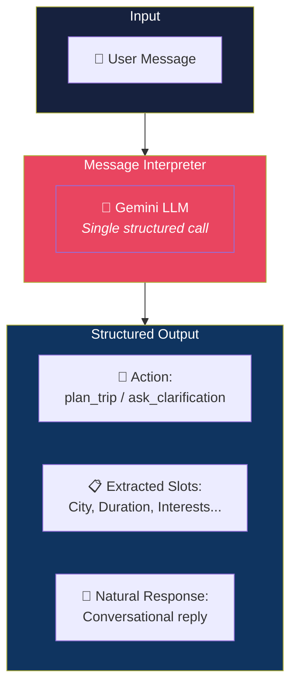

**How It Works:**
- A single LLM call replaces the old 3-call pattern (intent parser + clarification + chat)
- The LLM sees the full conversation history (last 10 messages)
- Outputs structured JSON with guaranteed schema via Pydantic
- **Safety Overrides** catch misclassifications (e.g., hotel keywords → `select_hotel`)

**Extracted Example:**
```
Action: plan_trip
City: Cairo | Duration: 5 days | Interests: [romantic, history, food]
Budget: moderate | Style: romantic | Pace: relaxed
```

---

## 📽️ Slide 4 — Slot Filling (Data Collection)

**Title:** Step 3 — Conversational Data Collection

**Visual:**

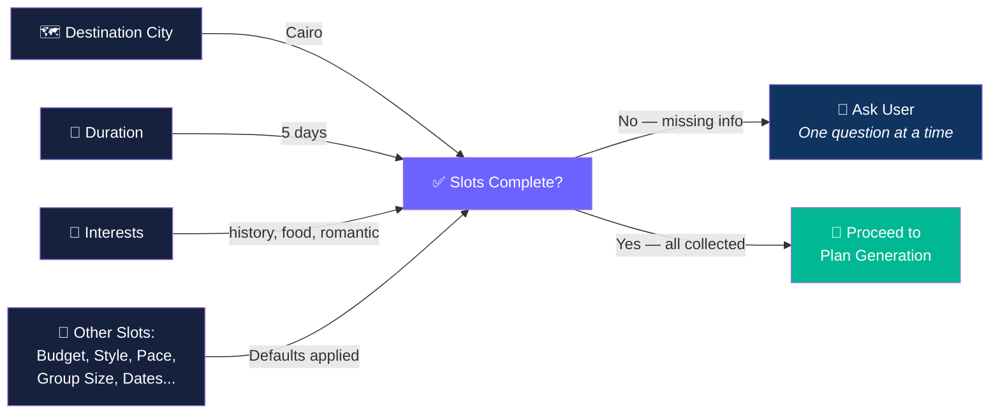

**Process:**
- Collects: City, Duration, Interests, Budget, Travel Style, Pace, Dates, Group Size
- **Smart defaults** for budget, style, pace → never ask unless needed
- **Interest guard:** Before planning, verifies interests are genuinely provided (not LLM-hallucinated)
- **Safety:** If user gives a country name (e.g., "Egypt"), asks for a specific city
- **Image fusion:** If user uploaded a photo, detected interests are merged into the slots

**Example Conversation:**
```
User:  "Plan a trip to Cairo"
TourMate: "Great! How many days are you planning?"
User:  "5 days"
TourMate: "What are you interested in? History, food, museums...?"
```

---

## 📽️ Slide 5 — Profile Loading & Place Retrieval

**Title:** Step 4 — Loading Profile & Discovering Places

**Visual:**

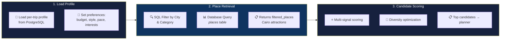

**Key Details:**
- **Profile:** Per-trip profile loaded from DB (not a static user profile — allows budget-conscious for Istanbul but luxury for Thailand)
- **Retrieval:** SQL-style filtering by city and category
- **Scoring:** Multi-signal formula + diversity optimization to avoid recommending 5 museums in a row

---

## 📽️ Slide 6 — AI Itinerary Planning

**Title:** Step 5 — AI Generates the Itinerary

**Visual:**

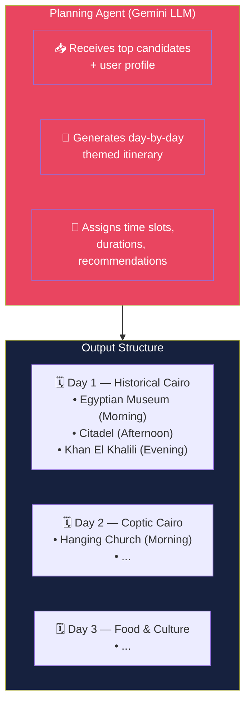

**How the LLM Plans:**
- Consumes pre-ranked candidates from upstream scoring
- Organizes places into themed days (e.g., "Historical Cairo", "Food Tour")
- Assigns time-of-day slots (morning/afternoon/evening)
- Includes why-recommended explanations for each stop
- Handles rate limits with automatic retry + progress reporting

**Progress Reported to User:**
```
"Building your 5-day itinerary..." → "Created 5 days with 18 stops"
```

---

## 📽️ Slide 7 — Route Optimization

**Title:** Step 6 — Optimizing the Route

**Visual:**

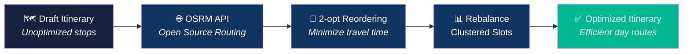

**Optimization Process:**
- **OSRM** calculates real driving/walking times between consecutive stops
- **2-opt algorithm** reorders stops to minimize total travel time per day
- **Slot rebalancing** clusters nearby places together
- Prevents zigzagging across the city

**Before vs After:**
```
Before: Museum → Far Park → Market → Another Far Museum
After:  Museum → Nearby Gallery → Market → Park (grouped by proximity)
```

---

## 📽️ Slide 8 — Itinerary Validation

**Title:** Step 7 — Quality Validation

**Visual:**

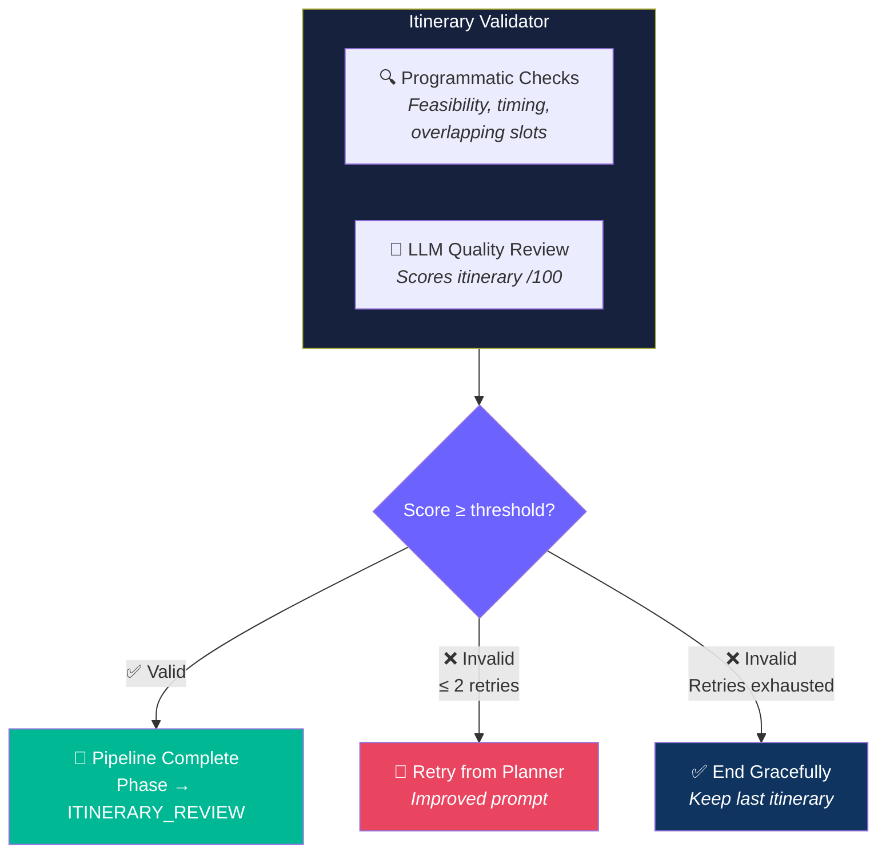

**Validation Checks:**
- **Programmatic:** Are time slots feasible? Are stops in logical order? Are any stops overlapping?
- **LLM Review:** Gemini scores the itinerary out of 100 based on quality, diversity, and feasibility
- **Retry Mechanism:** Up to 2 automatic retries from the planner node with improved prompts
- **Graceful Degradation:** If validation fails after max retries, the itinerary is still presented to the user

---

## 📽️ Slide 9 — Itinerary Review & Modification

**Title:** Step 8 — User Reviews & Modifies

**Visual:**

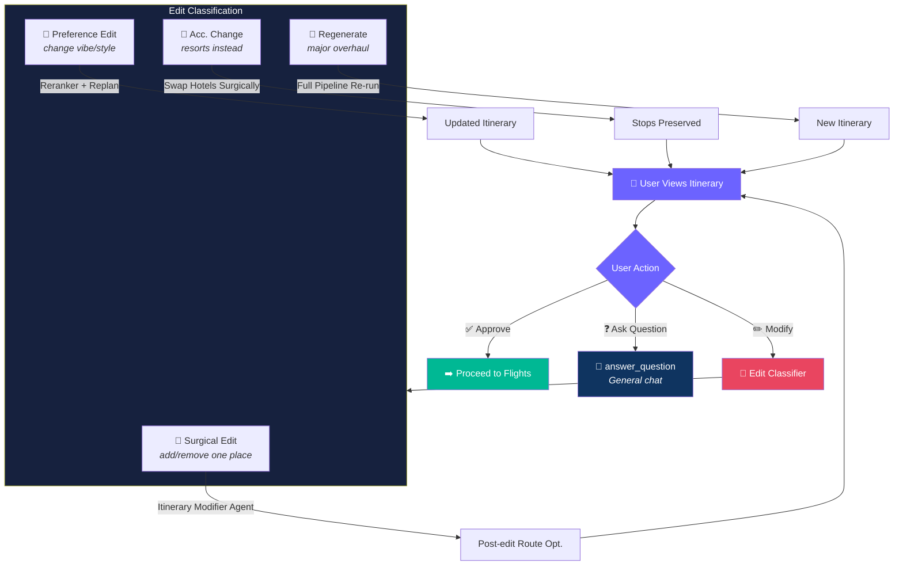

**Edit Classification Flow:**
1. **Accommodation change** (e.g., "resorts instead of hotels") → intercepted first, surgical swap
2. **Edit Classifier** determines the edit type:
   - **Surgical:** Modifier agent adds/removes/replaces a specific place → post-edit route optimization
   - **Preference:** Reranker re-ranks candidates → re-plans with new preferences
   - **Regenerate:** Full pipeline re-run from scratch
3. If the modifier fails, falls back to full regeneration

---

## 📽️ Slide 10 — Flight Selection

**Title:** Step 9 — Flight Selection (Amadeus)

**Visual:**

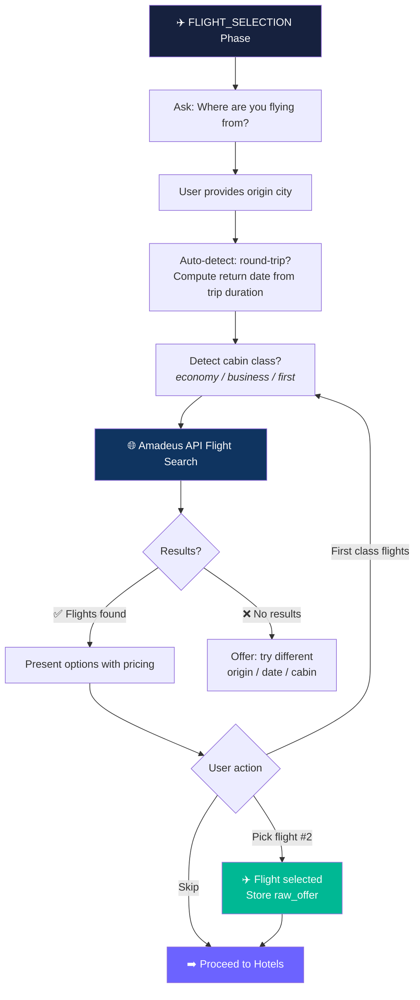

**Flight Features:**
- **Auto round-trip:** If trip is multi-day, automatically assumes round-trip
- **Auto return date:** Departure date + trip duration = return date
- **Cabin class detection:** "First class flights" → re-routes to search, not treated as picking flight #1
- **Raw offer stored:** Full Amadeus offer saved for payment processing
- **Skip option:** User can skip flights entirely

---

## 📽️ Slide 11 — Hotel Selection

**Title:** Step 10 — Hotel Selection

**Visual:**

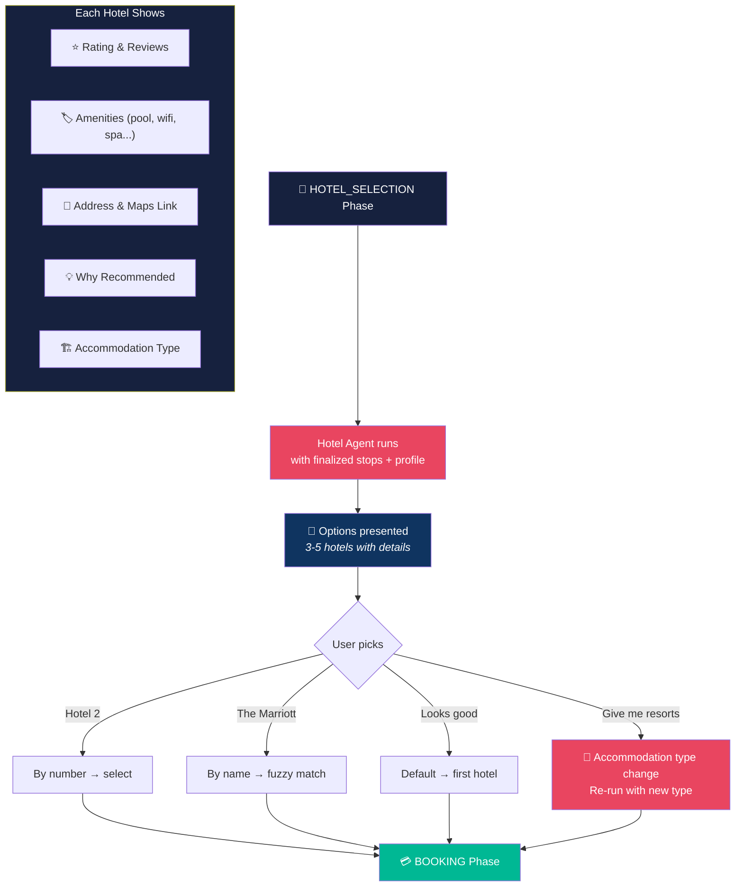

**Hotel Selection Process:**
- Runs **only after** itinerary stops are finalized (avoids wasted API calls)
- Hotel Agent searches the candidate pool matching the user's accommodation preferences
- Each hotel shows: name, rating, amenities, address, maps link, why-recommended
- User can pick by number, name, or accept default
- **Accommodation type change** re-runs hotel selection without restarting the flow

---

## 📽️ Slide 12 — Booking & Payment

**Title:** Step 11 — Final Booking & Payment

**Visual:**

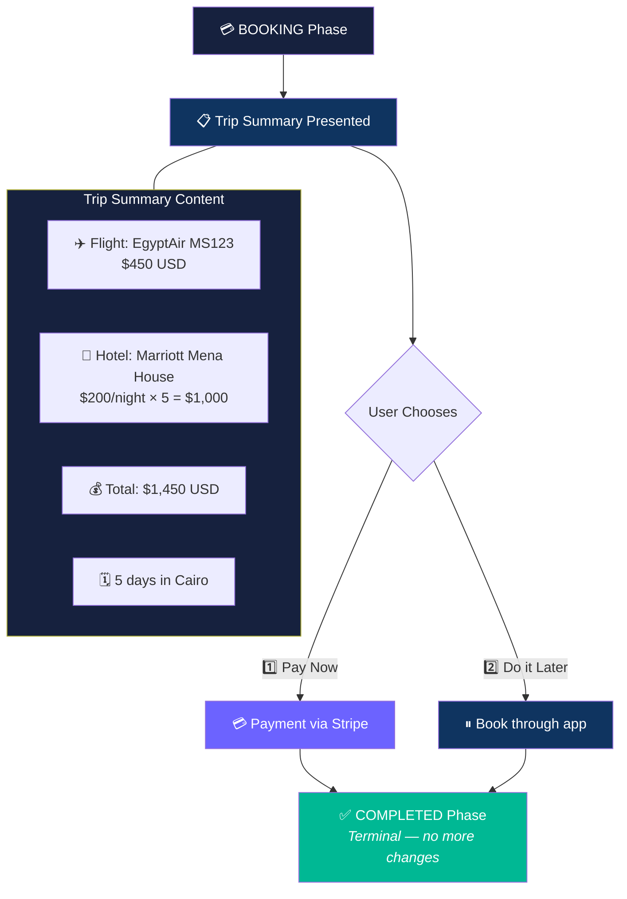

**Booking Data Sent to Flutter:**
```json
{
  "flight": { "airline": "EgyptAir", "flight_number": "MS123", "price": 450 },
  "hotel": { "name": "Marriott Mena House", "nightly_rate": 200, "total_cost": 1000 },
  "pricing": { "flight_cost": 450, "hotel_cost": 1000, "total_estimated": 1450 },
  "trip_summary": { "destination": "Cairo", "duration_days": 5 }
}
```

**🛑 Terminal Constraint:** One conversation = one trip. Once completed:
- Cannot start a new trip
- Cannot modify the existing itinerary
- Can only answer questions about the finalized trip

---

## 📽️ Slide 13 — Image Upload (Cross-Phase Feature)

**Title:** Bonus — Image-Powered Trip Planning

**Visual:**

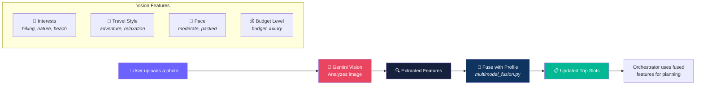

**Use Cases:**
- Upload a photo of a travel destination → AI detects interests
- Upload a food photo → AI detects cuisine preferences
- Can be done at **any phase** in the conversation
- Low-confidence images are gracefully ignored

---

## 📽️ Slide 14 — End-to-End Flow Summary

**Title:** Complete User Journey

**Visual:**

```mermaid
flowchart LR
    S1["💬 1. User Message<br/><i>Chat or Image</i>"] -->
    S2["🧠 2. Interpreter<br/><i>Intent + Slots</i>"] -->
    S3["📋 3. Slot Filling<br/><i>Data Collection</i>"] -->
    S4["🔍 4. Profile &<br/>Place Retrieval"] -->
    S5["🗺️ 5. AI Planning<br/><i>Itinerary Gen</i>"] -->
    S6["📐 6. Route Opt.<br/><i>OSRM</i>"] -->
    S7["✅ 7. Validation<br/><i>Quality Check</i>"]
    
    S7 --> S8["👤 8. Review &<br/>Modify"]
    
    S8 --> S9["✈️ 9. Flight<br/>Selection"]
    S8 --> S9
    
    S9 --> S10["🏨 10. Hotel<br/>Selection"]
    S10 --> S11["💳 11. Booking<br/>& Payment"]
    S11 --> S12["✅ 12. Completed<br/><i>Terminal</i>"]
    
    style S1 fill:#6c63ff,color:#fff
    style S2 fill:#e94560,color:#fff
    style S3 fill:#16213e,color:#fff
    style S4 fill:#0f3460,color:#fff
    style S5 fill:#e94560,color:#fff
    style S6 fill:#0f3460,color:#fff
    style S7 fill:#16213e,color:#fff
    style S8 fill:#6c63ff,color:#fff
    style S9 fill:#0f3460,color:#fff
    style S10 fill:#16213e,color:#fff
    style S11 fill:#e94560,color:#fff
    style S12 fill:#00b894,color:#fff
```

**Key Design Principles:**
1. ⚡ **Progressive Disclosure** — Never overwhelm the user; ask one question at a time
2. 🧠 **Single LLM Call** — One message interpreter replaces three separate calls
3. 🔄 **Edit Fallback Chain** — Surgical → Preference → Regeneration (optimal path first)
4. 🏨 **Late Hotel Selection** — Hotels chosen only after stops are finalized (avoids waste)
5. 🛑 **Terminal Phase** — One conversation produces exactly one trip
6. 📸 **Cross-Phase Vision** — Image analysis works at any stage

---

## 📋 How to Use These in Your Presentation

1. **Copy each slide section** into your preferred presentation tool
2. For Mermaid diagrams:
   - **Option A:** Visit [Mermaid Live Editor](https://mermaid.live/), paste the code, export as **PNG/SVG**
   - **Option B:** If your tool supports Mermaid (Notion, Obsidian, GitHub), paste the code directly
3. **Recommended export resolution:** 1920×1080 (16:9) for best quality in presentations
4. **Color palette reference:**
   - 🟣 Purple `#6c63ff` — User interactions
   - 🔴 Red `#e94560` — AI/LLM components
   - 🔵 Navy `#16213e` — Data/Storage layers
   - 🟢 Green `#00b894` — Success/Completion
   - 🌀 Dark blue `#0f3460` — Processing/API layers
