# Orchestrator Message Flow — plan_trip Request

> A Mermaid sequence diagram tracing a user's `plan_trip` message through the orchestrator, conversation state, pipeline agents, and external services.

```mermaid
---
title: plan_trip — Orchestrator Sequence Diagram
---
sequenceDiagram
    autonumber
    participant U as 👤 User
    participant O as 🧠 Orchestrator<br/>(_process_message)
    participant MI as 📨 Message Interpreter<br/>(interpret_message)
    participant CS as 💬 ConversationState<br/>(slots / phase / history)
    participant RM as 💾 Redis Memory
    participant IA as 🖼 Image Analyzer<br/>(Gemini 2.5 Flash)
    participant PL as 📋 Profile Loader
    participant PR as 🔍 Place Retriever
    participant CSco as 📊 Candidate Scorer
    participant PA as 🤖 Planning Agent<br/>(Gemini 2.5 Flash)
    participant RO as 🗺 Route Optimizer<br/>(OSRM + 2-opt)
    participant IV as ✅ Itinerary Validator<br/>(Groq Llama 3.3 70B)
    participant EX as 🌐 External (LLM / DB / OSRM)

    Note over U,EX: ─── PHASE 1: USER INPUT & ROUTING ───

    U->>O: "Plan me a 2-day trip to Cairo"

    O->>RM: resume_or_create(user_id, session_id)
    RM-->>O: ConversationState (GREETING phase)

    O->>IA: analyze_travel_image(image_bytes) [if present]
    IA-->>O: VisionFeatures (optional)

    O->>MI: interpret_message(state, message, history)
    Note right of MI: Unified Router (Groq Llama 3.3 70B)<br/>Single LLM call: intent + slots + response
    MI-->>O: RouterResult(action="plan_trip", extracted={...})

    O->>CS: slots.merge(extracted)
    O->>CS: add_user_message(message)

    alt Image with features
        O->>CS: fuse image interests into slots
    end

    Note over U,EX: ─── PHASE 2: SLOT FILLING ───

    O->>CS: slots.is_complete()
    CS-->>O: False (missing fields)

    O->>CS: transition_to(SLOT_FILLING)
    O-->>U: "What kind of trip? Where to, how many days...?"

    U->>O: "Cairo, 2 days, cultural trip"

    O->>MI: interpret_message(state, message)
    MI-->>O: RouterResult(action="plan_trip", extracted={city, duration, style})

    O->>CS: slots.merge(extracted)
    O->>CS: slots.is_complete()
    CS-->>O: True ✅

    Note over U,EX: ─── PHASE 3: PIPELINE KICKOFF ───

    O->>CS: transition_to(PLAN_GENERATION)
    O->>CS: plan_started_at = now()

    O->>O: _handle_plan_trip()

    alt Has complete slots
        O->>O: _build_profile_from_slots(slots, trip_id)
    else Has token
        O->>PL: load_trip_profile(trip_id, token)
        PL-->>O: TripProfile
    else No token
        O->>PL: load_mock_profile(trip_id)
        PL-->>O: TripProfile
    end

    alt Image features with confidence != low
        O->>O: fuse_image_with_profile(profile, image_features)
    end

    O->>O: Build initial TripState dict

    Note over U,EX: ─── PHASE 4: LANGGRAPH PIPELINE (6 nodes) ───

    O->>PL: trip_graph.ainvoke(initial_state)

    rect rgb(240, 248, 255)
        Note over PL,PR: Node 1: Profile Loader
        PL->>PL: Load profile (from state or DB)
        PL-->>PR: state["profile"] set

        Note over PR,CSco: Node 2: Place Retriever
        PR->>EX: get_places_for_city("Cairo")
        EX-->>PR: All Cairo places (attractions + restaurants)
        PR->>PR: Filter by preferences + interest subcategories
        PR->>PR: Cap at max candidates
        PR-->>CSco: state["filtered_places"]

        Note over CSco,PA: Node 3: Candidate Scorer
        CSco->>CSco: Score by popularity + embedding + rating + proximity
        CSco->>CSco: Diversity optimization per subcategory
        CSco-->>PA: state["candidate_places"] (up to 30)

        Note over PA,RO: Node 4: Planning Agent (Gemini 2.5 Flash)
        PA->>EX: LLM call with structured output (ItineraryPlan)
        EX-->>PA: Day-by-day plan with stops
        PA->>PA: Validate day count, hydrate stop details
        PA-->>RO: state["draft_itinerary"]

        Note over RO,IV: Node 5: Route Optimizer (OSRM + 2-opt)
        RO->>EX: compute_day_matrix(stops)
        EX-->>RO: Travel time matrix
        RO->>RO: Nearest-neighbor + 2-opt reorder
        RO-->>IV: state["optimized_itinerary"]

        Note over IV,O: Node 6: Itinerary Validator (Groq Llama 3.3 70B)
        IV->>IV: Programmatic checks (time, distance)
        IV->>EX: LLM quality evaluation
        EX-->>IV: {is_valid, score, issues}
        IV-->>O: state["is_valid"] + state["validation"]
    end

    alt Validation Failed & Retries Left
        Note over IV,PA: Edge: should_retry_or_end → "planner"
        PA->>EX: invoke_with_fallback (retry with feedback)
        EX-->>PA: Improved ItineraryPlan
    end

    Note over U,EX: ─── PHASE 5: RESULT PROCESSING ───

    O->>O: Extract optimized_itinerary, validation from result_state

    alt is_valid and optimized
        O->>O: _format_itinerary(optimized) → success
    else pipeline_error
        O->>O: Error message
    else optimized only (validation failed, exhausted retries)
        O->>O: Quality warning
    else no itinerary
        O->>O: Generation failed message
    end

    O->>CS: set_itinerary(optimized, candidate_places, filtered_places)
    O->>CS: add_assistant_message(message)
    O->>RM: save(state)
    O->>RM: extend_ttl(session_id)

    Note over U,EX: ─── PHASE 6: RESPONSE ───

    alt handle_chat
        O-->>U: {response_type, message, itinerary, validation, metrics}
    else handle_chat_stream
        O-->>U: stream: session → progress → phase → text chunks → result → done
    end

    Note over U,EX: ─── PHASE 7: POST-APPROVAL ───

    U->>O: "approve"

    O->>CS: transition_to(FLIGHT_SELECTION)
    O-->>U: "Would you like to book a flight? Where from?"

    alt User provides origin city
        U->>O: "From Dubai, on July 15, returning July 17"
        O->>O: search_flights_for_trip(departure, origin, dest, return)
        O-->>U: Available flight options
        U->>O: "Flight #2 looks good"
        O->>CS: Store selected_flight_offer
    else User skips flights
        U->>O: "No flights needed"
    end

    O->>O: _run_hotel_selection_and_present()
    Note right of O: Hotel Agent runs with finalized stops<br/>Rule-based + LLM hybrid

    O->>PR: run_hotel_selection(candidate_places, itinerary)
    PR-->>O: Updated itinerary with accommodation_suggestions

    O->>CS: transition_to(HOTEL_SELECTION)
    O-->>U: Hotel options with ratings, amenities, maps

    alt User selects hotel
        U->>O: "I'll take hotel #1"
        O->>CS: selected_hotel = hotels[0]
    else User requests different type
        U->>O: "Show resorts instead"
        O->>O: _swap_accommodation_surgically(resort)
        O-->>U: Updated hotel options
    end

    O->>CS: transition_to(BOOKING)
    O-->>U: "Pay now or do it later? 1️⃣ Pay Now  2️⃣ Do it later"

    alt User chooses "Pay Now"
        U->>O: "Pay now"
        O->>O: _build_booking_data(state)
        O->>CS: transition_to(COMPLETED)
        O-->>U: "Proceed to payment through the app"
        Note right of U: Flutter handles Stripe PaymentSheet<br/>via REST API endpoints
    else User chooses "Do it later"
        U->>O: "Do it later"
        O->>CS: transition_to(COMPLETED)
        O-->>U: ✅ Trip finalized! Summary with all selections
    end
```

## Flow Summary

| Phase | What Happens |
|---|---|
| **1. Input & Routing** | User message → Redis session load → Unified Router (single LLM call) → action classification (GREETING phase) |
| **2. Slot Filling** | If missing required info → ask clarification → loop until complete |
| **3. Pipeline Kickoff** | Build profile from slots/DB → fuse image features → build TripState |
| **4. LangGraph Pipeline (6 nodes)** | Profile Loader → Place Retriever → Candidate Scorer → Planning Agent (Gemini 2.5 Flash) → Route Optimizer (OSRM + 2-opt) → Itinerary Validator (Groq Llama 3.3 70B) |
| **5. Result Processing** | set_itinerary → transition to ITINERARY_REVIEW → user can approve or request modifications |
| **6. Response** | Return/stream response with itinerary, validation, metrics (ITINERARY_REVIEW phase) |
| **7. Post-Approval** | User approves → FLIGHT_SELECTION (search/select flights or skip) → HOTEL_SELECTION (hotel agent runs, user picks) → BOOKING (pay now via Flutter / do it later) → COMPLETED |
